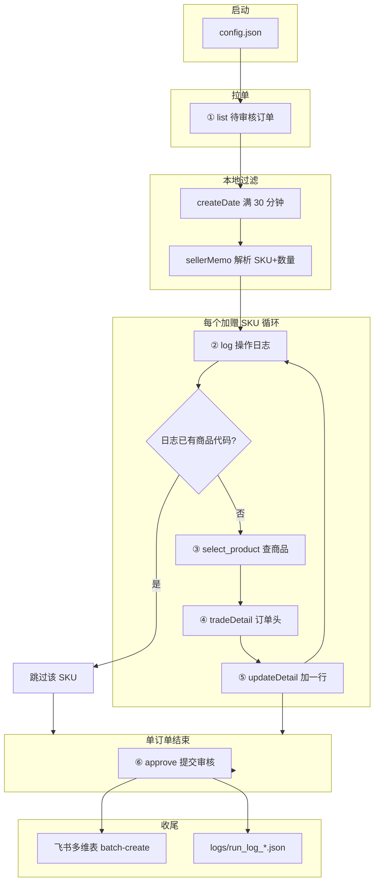

# 管易自动加赠品 → 审核：接口与字段关联说明

> 脚本入口：`add_gift_sku.py`  
> HTTP 封装：`guanyi_client.py`  
> 基础域名：`https://v2.guanyierp.com`  
> 认证：`guanyi_auth` 模拟登录（`config.json` → `guanyi.username/password`），请求 Cookie 仅 `loginAppkey` + `userId` + `shiroCookie`（= `sessionId`）。Header 含 `bx-v: 2.5.11`

### 登录流程（脚本启动时）

| 步骤 | URL | 产出 |
|------|-----|------|
| L1 | `POST login.guanyierp.com/login/loginDispatch` | 登录通过 |
| L2 | `GET` 金蝶 redirectUrl | 会话绑定 |
| L3 | `GET v2.guanyierp.com/index` | 主站会话 |
| L4 | `POST .../getTaobaoSign` | `sessionId`, `userId` |

**Cookie 组装**

| Cookie 名 | 值来源 |
|-----------|--------|
| loginAppkey | `config.guanyi.login_appkey`（默认 21226717） |
| userId | L4 返回 `data.userId` |
| shiroCookie | L4 返回 `data.sessionId` |

---

## 1. 端到端流程概览



**单订单、多 SKU**：步骤 ②～⑤ 对每个解析出的 SKU 各执行一遍；全部 SKU 处理完后执行 ⑥（满足审核条件时）。

---

## 2. 管易接口清单

| 序号 | 方法 | 路径 | 脚本函数 | 用途 |
|------|------|------|----------|------|
| ① | POST | `/tc/trade/trade_order_approve/data/list` | `list_approve_orders` | 分页拉待审核订单 |
| ② | POST | `/tc/log/log_query/data/log` | `query_order_log` | 查是否已加赠 |
| ③ | POST | `/ic/select_product/data/list` | `search_product` | 按编码查商品 |
| ④ | POST | `/tc/trade/trade_order_header/data/tradeDetail` | `get_trade_detail` | 加赠前校验订单可读 |
| ⑤ | POST | `/tc/trade/trade_order_header/updateDetail` | `update_order_detail` | 追加明细行保存 |
| ⑥ | POST | `/tc/trade/trade_order_approve/approve` | `approve_order` | 提交审核 |

公共请求头（除 ⑤ 外均由 `_post` 统一发送）：

| Header | 值 |
|--------|-----|
| Content-Type | `application/x-www-form-urlencoded; charset=UTF-8` |
| Origin / Referer | `https://v2.guanyierp.com` / 各接口 Referer 多为待审核页 |
| Cookie | 配置中的完整 Cookie 串 |
| bx-v | `2.5.11` |

---

## 3. 各接口入参 / 出参

### ① 待审核订单列表

**入参（form-urlencoded）**

| 参数 | 来源 | 说明 |
|------|------|------|
| page | 脚本分页 | 页码，从 1 递增 |
| limit | `config.page_size` | 每页条数，默认 50 |
| start | 脚本计算 | 偏移，`start += len(rows)` |
| shopIds | `config.shop_ids` | 店铺 ID |
| cod / chkMemo / hasInvoice / refund / financeReject | `config.list_filters` | 与页面筛选一致 |
| error | 代码固定 `0` | 列表筛选项 |

**出参（JSON，常用字段）**

| 字段 | 类型 | 下游用途 |
|------|------|----------|
| total | number | 分页终止条件 |
| rows[] | array | 每笔订单一条 |

**`rows[]` 单条 — 脚本实际使用的字段**

| 字段 | 示例 | 用途 |
|------|------|------|
| **id** | `981437876681` | **管易内部订单 ID**；②④⑤⑥ 的 `tid`/`pid`/`ids`/`tradeInfo.id` |
| **platformCode** | `6926458362323763163` | 平台订单号；CLI `--order-id` 匹配；飞书「订单号」 |
| code | `SO981437876681` | 系统单号；`--order-id` 可匹配 |
| uniqueTid | 常与 platformCode 相同 | `--order-id` 可匹配 |
| **sellerMemo** | `加赠 油 AFL-0011 66ml` | **解析加赠 SKU 与数量**（本地 `parse_gift_skus`） |
| **warehouseId** | `639951377088` | ③ 查商品库存仓；无则用 `config.warehouse_id` |
| **createDate** | `2026-05-20 12:49:11` | **半小时过滤**（`min_order_age_minutes`） |
| dealDate / paytime | 毫秒时间戳 | 时间解析备选 |

**出参示例（结构）**

```json
{
  "total": 20,
  "rows": [
    {
      "id": "981437876681",
      "platformCode": "6926458362323763163",
      "code": "SO981437876681",
      "sellerMemo": "加赠 油 AFL-0011 66ml    YHG-ZP-001 烟灰缸",
      "warehouseId": "639951377088",
      "createDate": "2026-05-20 12:49:11"
    }
  ]
}
```

---

### ② 订单操作日志

**入参**

| 参数 | 来源 | 说明 |
|------|------|------|
| page | 脚本分页 | 从 1 递增 |
| rows | `config.log_query_rows` | 每页条数，默认 50 |
| **tid** | ① `rows[].id` | 管易内部订单 ID |

**出参**

| 字段 | 说明 |
|------|------|
| total | 日志总条数 |
| status | `200` 表示成功 |
| rows[] | 日志记录 |

**`rows[]` 单条 — 判断是否已加赠**

| 字段 | 条件 | 说明 |
|------|------|------|
| action | 等于 `修改` | 才可能是加商品 |
| memo | 含 `新增商品` 且匹配 `商品代码XXX` | 正则提取 **itemCode** |

**memo 示例**

```text
新增商品 商品代码AFL-0011，规格名称；
```

**解析结果 → 与备注 SKU 比对**

| 日志提取 | 备注解析 (`gift.code`) | 结果 |
|----------|------------------------|------|
| `AFL-0011` | `AFL-0011` | 跳过加赠（`skipped_already_exists`） |
| 无 | `YHG-ZP-001` | 继续 ③ |

**出参示例**

```json
{
  "total": 3,
  "status": "200",
  "message": "操作成功",
  "rows": [
    {
      "action": "修改",
      "memo": "新增商品 商品代码AFL-0011，规格名称；",
      "operateId": 981437876681,
      "operator": "张春元",
      "created": 1779261088263
    }
  ]
}
```

---

### ③ 商品选择（库存查询）

**入参**

| 参数 | 来源 | 说明 |
|------|------|------|
| likeCode | 备注/日志解析的 **SKU 字符串** | 模糊查询关键字 |
| **warehouseId** | ① `warehouseId` 或 `config.warehouse_id` | 仓库 |
| page | 固定 1 | |
| rows | 固定 20 | |
| start | 0 | |
| disable | `false` | |
| load / categoryId / name / skuCode 等 | 空 | |

**出参 `rows[]` 单条 — 映射到 ⑤**

| 字段 | 写入 ⑤ `tradeOrderDetailList[]` | 说明 |
|------|--------------------------------|------|
| **id** | **skuId** | 管易 SKU 行 ID |
| **itemId** | **itemId** | 商品 ID |
| **itemCode** | 与 `likeCode` 精确比对 | 匹配成功才加赠 |
| itemName | 日志展示 | 商品名称 |
| itemSkuId / costPrice / weight | 可选带入 | |

**匹配逻辑（`find_product_exact`）**

1. 存在 `itemCode == sku`（忽略大小写）→ 采用该行  
2. 仅 1 条结果 → 采用该行  
3. 多条且无精确匹配 → `ambiguous_product` 失败  

**出参示例**

```json
{
  "total": 1,
  "status": "200",
  "rows": [
    {
      "id": "875143505979",
      "itemId": "875143517606",
      "itemCode": "AFL-0011",
      "itemName": "小油66ml",
      "salesPrice": 0.0,
      "stockQty": 358.0
    }
  ]
}
```

---

### ④ 订单头详情（tradeDetail）

**入参**

| 参数 | 来源 |
|------|------|
| **tid** | ① `rows[].id` |

**出参**

| 字段 | 说明 |
|------|------|
| status | `200` |
| data | 订单头对象（金额、收件人、**sellerMemo** 等） |

脚本仅校验接口可调通，**不把 data 字段传入 ⑤**。

**出参示例（节选）**

```json
{
  "status": "200",
  "data": {
    "id": "981229831180",
    "platformCode": "6952978354922788022",
    "code": "SO981229831180",
    "sellerMemo": "加赠 油 AFL-0011 66ml",
    "warehouseId": "639951377088",
    "amount": "309.0"
  }
}
```

---

### ⑤ 追加订单明细（加赠保存）

**入参**

| 参数 | 说明 |
|------|------|
| tradeInfo | URL 编码后的 JSON 字符串 |

**`tradeInfo` 解码后结构**

```json
{
  "id": "<① rows[].id>",
  "tradeOrderDetailList": [
    {
      "skuId": "<③ rows[].id>",
      "itemId": "<③ rows[].itemId>",
      "itemSkuId": null,
      "qty": "<备注解析数量 gift.qty>",
      "discount": 1,
      "originPrice": 0,
      "price": 0,
      "originAmount": 0,
      "amount": 0,
      "costPrice": 0,
      "type": "Item",
      "presale": false,
      "oid": "",
      "platformItemName": "",
      "platformSkuName": "",
      "weight": 0,
      "discountFee": 0,
      "postFee": 0,
      "otherServiceFee": 0
    }
  ]
}
```

**注意**：每次请求只追加 **一行**；一单 N 个 SKU 调用 N 次 ⑤。

**出参**

| 字段 | 成功条件 |
|------|----------|
| status | `200` |
| message | 含 **「保存成功」** |

成功后，管易会写入 ② 类日志（`action=修改`，`memo` 含 `商品代码{sku}`），下次运行会被 ② 识别为已加赠。

---

### ⑥ 提交审核

**入参**

| 参数 | 来源 |
|------|------|
| **ids** | ① `rows[].id`（管易内部订单 ID，非 platformCode） |

**出参**

| 字段 | 成功条件 |
|------|----------|
| status | `200` |
| message | 含「成功」类文案（如「审核任务提交成功」） |

**触发条件（`should_approve_order`）**

- `config.auto_approve` 为 true  
- 无 `failed` / `product_not_found` / `ambiguous_product`  
- 至少一个 SKU `added`，或全部 SKU 为 `added` / `skipped_already_exists`（`approve_when_ready`）

---

## 4. 核心字段关联总表

| 业务含义 | ① 列表 | ② 日志 | ③ 商品 | ⑤ 加赠 | ⑥ 审核 | 飞书表 |
|----------|--------|--------|--------|--------|--------|--------|
| 管易订单 ID | **id** | tid ← id | — | tradeInfo.**id** | **ids** | — |
| 平台订单号 | **platformCode** | — | — | — | — | **订单号** |
| 卖家备注 | **sellerMemo** | — | — | — | — | **备注** |
| 加赠编码 | 解析自 sellerMemo | memo 正则 | likeCode ← 解析 | — | — | **加赠商品编码** |
| 加赠数量 | 解析自 sellerMemo | — | — | **qty** | — | — |
| SKU 行 ID | — | — | **id** → skuId | **skuId** | — | — |
| 商品 ID | — | — | **itemId** | **itemId** | — | — |
| 商品编码 | — | 商品代码 XXX | **itemCode** | — | — | 对齐 action.sku |
| 仓库 | **warehouseId** | — | **warehouseId** | — | — | — |

**ID 类型务必区分**

| 类型 | 字段名 | 用于 |
|------|--------|------|
| 管易内部订单 ID | `id` / `tid` / `pid` / `ids` | ②④⑤⑥ |
| 平台订单号 | `platformCode` | 人工查单、`--order-id`、飞书 |
| 商品 SKU 行 ID | 商品列表 `id` | ⑤ `skuId` |
| 商品主档 ID | 商品列表 `itemId` | ⑤ `itemId` |

---

## 5. 本地处理（非管易 API）

### 5.1 备注解析 `sku_parser.parse_gift_skus`

**输入**：① `sellerMemo`

**输出**：`GiftSku[]`，例如 `[{code: "AFL-0011", qty: 1}, {code: "YHG-ZP-001", qty: 1}]`

| 规则 | 说明 |
|------|------|
| 片段 | `[A-Za-z0-9-]+` 连续匹配 |
| 有效 SKU | 含 `-`，或同时含字母+数字（如 `2406NCZ`） |
| 排除 | `66ml` 等容量规格（数字+ml/g/kg…） |
| 数量 | 每个 SKU **前面** 文本中的 `两组/2个/×3` 等，默认 1 |

### 5.2 时间过滤 `order_time`

| 配置 | 默认 |
|------|------|
| min_order_age_minutes | 30 |

`createDate`（或 dealDate/paytime）早于「当前 − N 分钟」才处理；`--order-id` 单笔不受限。

---

## 6. 飞书多维表（收尾）

非管易接口，通过 `lark-cli`：

```bash
lark-cli base +record-batch-create \
  --as <config.feishu.as> \
  --base-token <config.feishu.base_token> \
  --table-id <config.feishu.table_id> \
  --json '{"fields":[...],"rows":[[...]]}'
```

`config.feishu.as` 为 `user` 或 `bot`。表若设为「链接只读、仅协作者可写」，该身份须已是 Base 协作者且权限为**可编辑**。

**一行对应一个 SKU 处理结果**（非一单一行）。

| 飞书列 | 数据来源 |
|--------|----------|
| 订单号 | `platformCode` |
| 备注 | `sellerMemo` |
| 加赠商品编码 | `action.sku` |
| 加赠商品名称 | `action.message` 解析 |
| 加赠商品规格 | `action.message` / 错误信息 |
| 审核状态 | 根据 added / approved / failed 推断 |
| 审核时间 | 状态为「已通过」时写当前时间 |

默认 Base：[订单记录表](https://doubleline.feishu.cn/wiki/TosvwRZ7lifUu9kIuKgcjuNqnTw)

---

## 7. 单订单多 SKU 时序示例

备注：`加赠 油 AFL-0011 66ml    YHG-ZP-001 烟灰缸-赠品缸`

| 步骤 | SKU | 说明 |
|------|-----|------|
| 解析 | AFL-0011×1, YHG-ZP-001×1 | 忽略 `66ml` |
| ② | — | 假设日志无记录 |
| ③→④→⑤ | AFL-0011 | 加 1 件，日志写入「商品代码AFL-0011」 |
| ② | AFL-0011 | 内存 `log_added_skus` 追加，避免同轮重复 |
| ③→④→⑤ | YHG-ZP-001 | 加 1 件 |
| ⑥ | ids=订单 id | 两 SKU 均成功则审核 |

---

## 8. 本地运行日志

路径：`logs/run_log_YYYYMMDD_HHMMSS.json`

含 `summary` 统计与每单 `parsed_gifts`、`actions`（状态：added / skipped_already_exists / approved 等）。

---

## 9. 相关代码文件

| 文件 | 职责 |
|------|------|
| `add_gift_sku.py` | 主流程、审核判断、汇总 |
| `guanyi_client.py` | ①～⑥ HTTP |
| `sku_parser.py` | 备注 SKU/数量 |
| `order_log.py` | ② 日志解析 |
| `order_time.py` | 创建时间过滤 |
| `feishu_bitable.py` | 飞书同步 |
| `guanyi_auth.py` | 登录与 Cookie |
| `config.json` | 账号、店铺、仓库、开关 |
